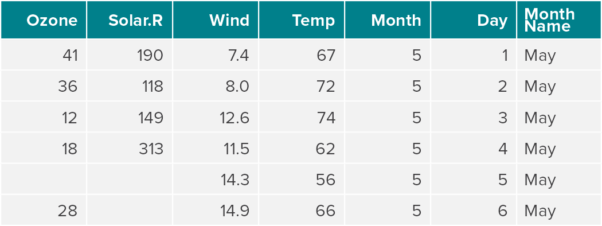
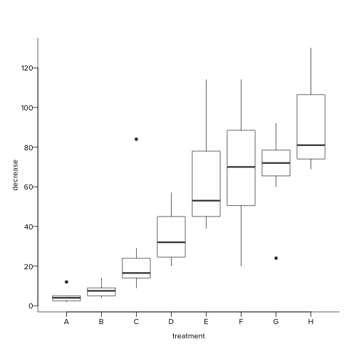
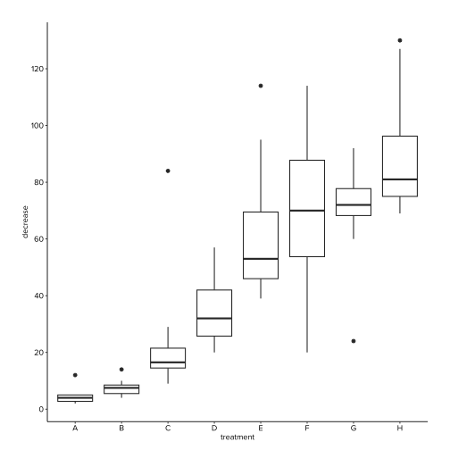

<!-- README.md is generated from README.Rmd. Please edit that file -->

<!-- badges: start -->

[](https://www.repostatus.org/#active)
[](https://github.com/AAGI-Org-AU-Public/AAGIThemes/actions/workflows/R-CMD-check.yaml)
<!-- badges: end -->

# {AAGIThemes} AAGI Branding for R Graphical and Tabular Outputs 

This repository contains the code for the R package {AAGIThemes}, which
once installed in your R session (local or RStudio Server), provides
helper functions for creating and exporting graphics created in R with a
unified style that follows the AAGI brand guidelines.

The goal of {AAGIThemes} is to provide easy to use theming of R graphics
for AAGI team members. Following AAGI’s brand guidelines, AAGI colours
are used where applicable and the font defaults to Proxima Nova. The
resulting graphs, plots and charts feature a x and y axis that meet at 0
with no gridlines, but these can optionally be set to appear. The
resulting maps from `theme_aagi_map()` feature a white canvas with the
legend on the right.

## Installation instructions

You can install {AAGIThemes} like so:

``` r
if (!requireNamespace("remotes", quietly = TRUE)) {
  install.packages("remotes")
}
remotes::install_github("AAGI-Org-AU-Public/AAGIThemes",
                        build_vignettes = TRUE,
                        dependencies = TRUE
)
```

## Quick start

Following are some quick examples of {AAGIThemes} functionality.
However, you may wish to browse the vignette for a more detailed look at
what the package offers using:

``` r
vignette("Cookbook", package = "AAGIThemes")
```

### Create Tabular Outputs

{AAGIThemes} provides a {flextable} theme suited for the AAGI style that
works in HTML and Word document outputs. You can use it like so.

``` r
library(AAGIThemes)
library(dplyr)
#> 
#> Attaching package: 'dplyr'
#> The following objects are masked from 'package:stats':
#> 
#>     filter, lag
#> The following objects are masked from 'package:base':
#> 
#>     intersect, setdiff, setequal, union
library(flextable)
ft <- flextable(head(airquality) |>
 mutate(`Month Name` = "May"))
ft <- theme_ft_aagi(ft)
ft
```



{AAGIThemes} provides a {gt} theme suited for the AAGI style that works
best in HTML outputs. You can use it like so.

``` r
library(AAGIThemes)
library(dplyr)
library(gt)
gt <- head(airquality) |>
 mutate(`Month Name` = "May") |>
 gt()
gt <- theme_gt_aagi(gt)
gt
```

<div id="qhnfteftjs" style="padding-left:0px;padding-right:0px;padding-top:10px;padding-bottom:10px;overflow-x:auto;overflow-y:auto;width:auto;height:auto;">
<style>#qhnfteftjs table {
  font-family: 'Proxima Nova', system-ui, 'Segoe UI', Roboto, Helvetica, Arial, sans-serif, 'Apple Color Emoji', 'Segoe UI Emoji', 'Segoe UI Symbol', 'Noto Color Emoji';
  -webkit-font-smoothing: antialiased;
  -moz-osx-font-smoothing: grayscale;
}
&#10;#qhnfteftjs thead, #qhnfteftjs tbody, #qhnfteftjs tfoot, #qhnfteftjs tr, #qhnfteftjs td, #qhnfteftjs th {
  border-style: none;
}
&#10;#qhnfteftjs p {
  margin: 0;
  padding: 0;
}
&#10;#qhnfteftjs .gt_table {
  display: table;
  border-collapse: collapse;
  line-height: normal;
  margin-left: auto;
  margin-right: auto;
  color: #414042;
  font-size: 16px;
  font-weight: normal;
  font-style: normal;
  background-color: #F2F2F2;
  width: auto;
  border-top-style: solid;
  border-top-width: 2px;
  border-top-color: #A8A8A8;
  border-right-style: none;
  border-right-width: 2px;
  border-right-color: #D3D3D3;
  border-bottom-style: solid;
  border-bottom-width: 2px;
  border-bottom-color: #A8A8A8;
  border-left-style: none;
  border-left-width: 2px;
  border-left-color: #D3D3D3;
}
&#10;#qhnfteftjs .gt_caption {
  padding-top: 4px;
  padding-bottom: 4px;
}
&#10;#qhnfteftjs .gt_title {
  color: #414042;
  font-size: 125%;
  font-weight: initial;
  padding-top: 4px;
  padding-bottom: 4px;
  padding-left: 5px;
  padding-right: 5px;
  border-bottom-color: #F2F2F2;
  border-bottom-width: 0;
}
&#10;#qhnfteftjs .gt_subtitle {
  color: #414042;
  font-size: 85%;
  font-weight: initial;
  padding-top: 3px;
  padding-bottom: 5px;
  padding-left: 5px;
  padding-right: 5px;
  border-top-color: #F2F2F2;
  border-top-width: 0;
}
&#10;#qhnfteftjs .gt_heading {
  background-color: #F2F2F2;
  text-align: center;
  border-bottom-color: #F2F2F2;
  border-left-style: none;
  border-left-width: 1px;
  border-left-color: #D3D3D3;
  border-right-style: none;
  border-right-width: 1px;
  border-right-color: #D3D3D3;
}
&#10;#qhnfteftjs .gt_bottom_border {
  border-bottom-style: solid;
  border-bottom-width: 2px;
  border-bottom-color: #D3D3D3;
}
&#10;#qhnfteftjs .gt_col_headings {
  border-top-style: solid;
  border-top-width: 2px;
  border-top-color: #D3D3D3;
  border-bottom-style: solid;
  border-bottom-width: 2px;
  border-bottom-color: #D3D3D3;
  border-left-style: none;
  border-left-width: 1px;
  border-left-color: #D3D3D3;
  border-right-style: none;
  border-right-width: 1px;
  border-right-color: #D3D3D3;
}
&#10;#qhnfteftjs .gt_col_heading {
  color: #FFFFFF;
  background-color: #00808B;
  font-size: 100%;
  font-weight: bold;
  text-transform: inherit;
  border-left-style: none;
  border-left-width: 1px;
  border-left-color: #D3D3D3;
  border-right-style: none;
  border-right-width: 1px;
  border-right-color: #D3D3D3;
  vertical-align: bottom;
  padding-top: 5px;
  padding-bottom: 6px;
  padding-left: 5px;
  padding-right: 5px;
  overflow-x: hidden;
}
&#10;#qhnfteftjs .gt_column_spanner_outer {
  color: #FFFFFF;
  background-color: #00808B;
  font-size: 100%;
  font-weight: bold;
  text-transform: inherit;
  padding-top: 0;
  padding-bottom: 0;
  padding-left: 4px;
  padding-right: 4px;
}
&#10;#qhnfteftjs .gt_column_spanner_outer:first-child {
  padding-left: 0;
}
&#10;#qhnfteftjs .gt_column_spanner_outer:last-child {
  padding-right: 0;
}
&#10;#qhnfteftjs .gt_column_spanner {
  border-bottom-style: solid;
  border-bottom-width: 2px;
  border-bottom-color: #D3D3D3;
  vertical-align: bottom;
  padding-top: 5px;
  padding-bottom: 5px;
  overflow-x: hidden;
  display: inline-block;
  width: 100%;
}
&#10;#qhnfteftjs .gt_spanner_row {
  border-bottom-style: hidden;
}
&#10;#qhnfteftjs .gt_group_heading {
  padding-top: 8px;
  padding-bottom: 8px;
  padding-left: 5px;
  padding-right: 5px;
  color: #414042;
  background-color: #F2F2F2;
  font-size: 100%;
  font-weight: initial;
  text-transform: inherit;
  border-top-style: solid;
  border-top-width: 2px;
  border-top-color: #D3D3D3;
  border-bottom-style: solid;
  border-bottom-width: 2px;
  border-bottom-color: #D3D3D3;
  border-left-style: none;
  border-left-width: 1px;
  border-left-color: #D3D3D3;
  border-right-style: none;
  border-right-width: 1px;
  border-right-color: #D3D3D3;
  vertical-align: middle;
  text-align: left;
}
&#10;#qhnfteftjs .gt_empty_group_heading {
  padding: 0.5px;
  color: #414042;
  background-color: #F2F2F2;
  font-size: 100%;
  font-weight: initial;
  border-top-style: solid;
  border-top-width: 2px;
  border-top-color: #D3D3D3;
  border-bottom-style: solid;
  border-bottom-width: 2px;
  border-bottom-color: #D3D3D3;
  vertical-align: middle;
}
&#10;#qhnfteftjs .gt_from_md > :first-child {
  margin-top: 0;
}
&#10;#qhnfteftjs .gt_from_md > :last-child {
  margin-bottom: 0;
}
&#10;#qhnfteftjs .gt_row {
  padding-top: 8px;
  padding-bottom: 8px;
  padding-left: 5px;
  padding-right: 5px;
  margin: 10px;
  border-top-style: solid;
  border-top-width: 1px;
  border-top-color: #D3D3D3;
  border-left-style: none;
  border-left-width: 1px;
  border-left-color: #D3D3D3;
  border-right-style: none;
  border-right-width: 1px;
  border-right-color: #D3D3D3;
  vertical-align: middle;
  overflow-x: hidden;
}
&#10;#qhnfteftjs .gt_stub {
  color: #414042;
  background-color: #F2F2F2;
  font-size: 100%;
  font-weight: initial;
  text-transform: inherit;
  border-right-style: solid;
  border-right-width: 2px;
  border-right-color: #D3D3D3;
  padding-left: 5px;
  padding-right: 5px;
}
&#10;#qhnfteftjs .gt_stub_row_group {
  color: #414042;
  background-color: #F2F2F2;
  font-size: 100%;
  font-weight: initial;
  text-transform: inherit;
  border-right-style: solid;
  border-right-width: 2px;
  border-right-color: #D3D3D3;
  padding-left: 5px;
  padding-right: 5px;
  vertical-align: top;
}
&#10;#qhnfteftjs .gt_row_group_first td {
  border-top-width: 2px;
}
&#10;#qhnfteftjs .gt_row_group_first th {
  border-top-width: 2px;
}
&#10;#qhnfteftjs .gt_summary_row {
  color: #414042;
  background-color: #F2F2F2;
  text-transform: inherit;
  padding-top: 8px;
  padding-bottom: 8px;
  padding-left: 5px;
  padding-right: 5px;
}
&#10;#qhnfteftjs .gt_first_summary_row {
  border-top-style: solid;
  border-top-color: #D3D3D3;
}
&#10;#qhnfteftjs .gt_first_summary_row.thick {
  border-top-width: 2px;
}
&#10;#qhnfteftjs .gt_last_summary_row {
  padding-top: 8px;
  padding-bottom: 8px;
  padding-left: 5px;
  padding-right: 5px;
  border-bottom-style: solid;
  border-bottom-width: 2px;
  border-bottom-color: #D3D3D3;
}
&#10;#qhnfteftjs .gt_grand_summary_row {
  color: #414042;
  background-color: #F2F2F2;
  text-transform: inherit;
  padding-top: 8px;
  padding-bottom: 8px;
  padding-left: 5px;
  padding-right: 5px;
}
&#10;#qhnfteftjs .gt_first_grand_summary_row {
  padding-top: 8px;
  padding-bottom: 8px;
  padding-left: 5px;
  padding-right: 5px;
  border-top-style: double;
  border-top-width: 6px;
  border-top-color: #D3D3D3;
}
&#10;#qhnfteftjs .gt_last_grand_summary_row_top {
  padding-top: 8px;
  padding-bottom: 8px;
  padding-left: 5px;
  padding-right: 5px;
  border-bottom-style: double;
  border-bottom-width: 6px;
  border-bottom-color: #D3D3D3;
}
&#10;#qhnfteftjs .gt_striped {
  background-color: rgba(128, 128, 128, 0.05);
}
&#10;#qhnfteftjs .gt_table_body {
  border-top-style: solid;
  border-top-width: 2px;
  border-top-color: #D3D3D3;
  border-bottom-style: solid;
  border-bottom-width: 2px;
  border-bottom-color: #D3D3D3;
}
&#10;#qhnfteftjs .gt_footnotes {
  color: #414042;
  background-color: #F2F2F2;
  border-bottom-style: none;
  border-bottom-width: 2px;
  border-bottom-color: #D3D3D3;
  border-left-style: none;
  border-left-width: 2px;
  border-left-color: #D3D3D3;
  border-right-style: none;
  border-right-width: 2px;
  border-right-color: #D3D3D3;
}
&#10;#qhnfteftjs .gt_footnote {
  margin: 0px;
  font-size: 90%;
  padding-top: 4px;
  padding-bottom: 4px;
  padding-left: 5px;
  padding-right: 5px;
}
&#10;#qhnfteftjs .gt_sourcenotes {
  color: #414042;
  background-color: #F2F2F2;
  border-bottom-style: none;
  border-bottom-width: 2px;
  border-bottom-color: #D3D3D3;
  border-left-style: none;
  border-left-width: 2px;
  border-left-color: #D3D3D3;
  border-right-style: none;
  border-right-width: 2px;
  border-right-color: #D3D3D3;
}
&#10;#qhnfteftjs .gt_sourcenote {
  font-size: 90%;
  padding-top: 4px;
  padding-bottom: 4px;
  padding-left: 5px;
  padding-right: 5px;
}
&#10;#qhnfteftjs .gt_left {
  text-align: left;
}
&#10;#qhnfteftjs .gt_center {
  text-align: center;
}
&#10;#qhnfteftjs .gt_right {
  text-align: right;
  font-variant-numeric: tabular-nums;
}
&#10;#qhnfteftjs .gt_font_normal {
  font-weight: normal;
}
&#10;#qhnfteftjs .gt_font_bold {
  font-weight: bold;
}
&#10;#qhnfteftjs .gt_font_italic {
  font-style: italic;
}
&#10;#qhnfteftjs .gt_super {
  font-size: 65%;
}
&#10;#qhnfteftjs .gt_footnote_marks {
  font-size: 75%;
  vertical-align: 0.4em;
  position: initial;
}
&#10;#qhnfteftjs .gt_asterisk {
  font-size: 100%;
  vertical-align: 0;
}
&#10;#qhnfteftjs .gt_indent_1 {
  text-indent: 5px;
}
&#10;#qhnfteftjs .gt_indent_2 {
  text-indent: 10px;
}
&#10;#qhnfteftjs .gt_indent_3 {
  text-indent: 15px;
}
&#10;#qhnfteftjs .gt_indent_4 {
  text-indent: 20px;
}
&#10;#qhnfteftjs .gt_indent_5 {
  text-indent: 25px;
}
&#10;#qhnfteftjs .katex-display {
  display: inline-flex !important;
  margin-bottom: 0.75em !important;
}
&#10;#qhnfteftjs div.Reactable > div.rt-table > div.rt-thead > div.rt-tr.rt-tr-group-header > div.rt-th-group:after {
  height: 0px !important;
}
</style>
<table class="gt_table" data-quarto-disable-processing="false" data-quarto-bootstrap="false">
  <thead>
    <tr class="gt_col_headings">
      <th class="gt_col_heading gt_columns_bottom_border gt_right" rowspan="1" colspan="1" style="border-left-width: 2px; border-left-style: solid; border-left-color: #ffffff; border-right-width: 2px; border-right-style: solid; border-right-color: #ffffff; border-top-width: 2px; border-top-style: solid; border-top-color: #ffffff; border-bottom-width: 2px; border-bottom-style: solid; border-bottom-color: #ffffff;" scope="col" id="Ozone">Ozone</th>
      <th class="gt_col_heading gt_columns_bottom_border gt_right" rowspan="1" colspan="1" style="border-left-width: 2px; border-left-style: solid; border-left-color: #ffffff; border-right-width: 2px; border-right-style: solid; border-right-color: #ffffff; border-top-width: 2px; border-top-style: solid; border-top-color: #ffffff; border-bottom-width: 2px; border-bottom-style: solid; border-bottom-color: #ffffff;" scope="col" id="Solar.R">Solar.R</th>
      <th class="gt_col_heading gt_columns_bottom_border gt_right" rowspan="1" colspan="1" style="border-left-width: 2px; border-left-style: solid; border-left-color: #ffffff; border-right-width: 2px; border-right-style: solid; border-right-color: #ffffff; border-top-width: 2px; border-top-style: solid; border-top-color: #ffffff; border-bottom-width: 2px; border-bottom-style: solid; border-bottom-color: #ffffff;" scope="col" id="Wind">Wind</th>
      <th class="gt_col_heading gt_columns_bottom_border gt_right" rowspan="1" colspan="1" style="border-left-width: 2px; border-left-style: solid; border-left-color: #ffffff; border-right-width: 2px; border-right-style: solid; border-right-color: #ffffff; border-top-width: 2px; border-top-style: solid; border-top-color: #ffffff; border-bottom-width: 2px; border-bottom-style: solid; border-bottom-color: #ffffff;" scope="col" id="Temp">Temp</th>
      <th class="gt_col_heading gt_columns_bottom_border gt_right" rowspan="1" colspan="1" style="border-left-width: 2px; border-left-style: solid; border-left-color: #ffffff; border-right-width: 2px; border-right-style: solid; border-right-color: #ffffff; border-top-width: 2px; border-top-style: solid; border-top-color: #ffffff; border-bottom-width: 2px; border-bottom-style: solid; border-bottom-color: #ffffff;" scope="col" id="Month">Month</th>
      <th class="gt_col_heading gt_columns_bottom_border gt_right" rowspan="1" colspan="1" style="border-left-width: 2px; border-left-style: solid; border-left-color: #ffffff; border-right-width: 2px; border-right-style: solid; border-right-color: #ffffff; border-top-width: 2px; border-top-style: solid; border-top-color: #ffffff; border-bottom-width: 2px; border-bottom-style: solid; border-bottom-color: #ffffff;" scope="col" id="Day">Day</th>
      <th class="gt_col_heading gt_columns_bottom_border gt_left" rowspan="1" colspan="1" style="border-left-width: 2px; border-left-style: solid; border-left-color: #ffffff; border-right-width: 2px; border-right-style: solid; border-right-color: #ffffff; border-top-width: 2px; border-top-style: solid; border-top-color: #ffffff; border-bottom-width: 2px; border-bottom-style: solid; border-bottom-color: #ffffff;" scope="col" id="Month Name">Month Name</th>
    </tr>
  </thead>
  <tbody class="gt_table_body">
    <tr><td headers="Ozone" class="gt_row gt_right" style="border-left-width: 2px; border-left-style: solid; border-left-color: #ffffff; border-right-width: 2px; border-right-style: solid; border-right-color: #ffffff; border-top-width: 2px; border-top-style: solid; border-top-color: #ffffff; border-bottom-width: 2px; border-bottom-style: solid; border-bottom-color: #ffffff;">41</td>
<td headers="Solar.R" class="gt_row gt_right" style="border-left-width: 2px; border-left-style: solid; border-left-color: #ffffff; border-right-width: 2px; border-right-style: solid; border-right-color: #ffffff; border-top-width: 2px; border-top-style: solid; border-top-color: #ffffff; border-bottom-width: 2px; border-bottom-style: solid; border-bottom-color: #ffffff;">190</td>
<td headers="Wind" class="gt_row gt_right" style="border-left-width: 2px; border-left-style: solid; border-left-color: #ffffff; border-right-width: 2px; border-right-style: solid; border-right-color: #ffffff; border-top-width: 2px; border-top-style: solid; border-top-color: #ffffff; border-bottom-width: 2px; border-bottom-style: solid; border-bottom-color: #ffffff;">7.4</td>
<td headers="Temp" class="gt_row gt_right" style="border-left-width: 2px; border-left-style: solid; border-left-color: #ffffff; border-right-width: 2px; border-right-style: solid; border-right-color: #ffffff; border-top-width: 2px; border-top-style: solid; border-top-color: #ffffff; border-bottom-width: 2px; border-bottom-style: solid; border-bottom-color: #ffffff;">67</td>
<td headers="Month" class="gt_row gt_right" style="border-left-width: 2px; border-left-style: solid; border-left-color: #ffffff; border-right-width: 2px; border-right-style: solid; border-right-color: #ffffff; border-top-width: 2px; border-top-style: solid; border-top-color: #ffffff; border-bottom-width: 2px; border-bottom-style: solid; border-bottom-color: #ffffff;">5</td>
<td headers="Day" class="gt_row gt_right" style="border-left-width: 2px; border-left-style: solid; border-left-color: #ffffff; border-right-width: 2px; border-right-style: solid; border-right-color: #ffffff; border-top-width: 2px; border-top-style: solid; border-top-color: #ffffff; border-bottom-width: 2px; border-bottom-style: solid; border-bottom-color: #ffffff;">1</td>
<td headers="Month Name" class="gt_row gt_left" style="border-left-width: 2px; border-left-style: solid; border-left-color: #ffffff; border-right-width: 2px; border-right-style: solid; border-right-color: #ffffff; border-top-width: 2px; border-top-style: solid; border-top-color: #ffffff; border-bottom-width: 2px; border-bottom-style: solid; border-bottom-color: #ffffff;">May</td></tr>
    <tr><td headers="Ozone" class="gt_row gt_right" style="border-left-width: 2px; border-left-style: solid; border-left-color: #ffffff; border-right-width: 2px; border-right-style: solid; border-right-color: #ffffff; border-top-width: 2px; border-top-style: solid; border-top-color: #ffffff; border-bottom-width: 2px; border-bottom-style: solid; border-bottom-color: #ffffff;">36</td>
<td headers="Solar.R" class="gt_row gt_right" style="border-left-width: 2px; border-left-style: solid; border-left-color: #ffffff; border-right-width: 2px; border-right-style: solid; border-right-color: #ffffff; border-top-width: 2px; border-top-style: solid; border-top-color: #ffffff; border-bottom-width: 2px; border-bottom-style: solid; border-bottom-color: #ffffff;">118</td>
<td headers="Wind" class="gt_row gt_right" style="border-left-width: 2px; border-left-style: solid; border-left-color: #ffffff; border-right-width: 2px; border-right-style: solid; border-right-color: #ffffff; border-top-width: 2px; border-top-style: solid; border-top-color: #ffffff; border-bottom-width: 2px; border-bottom-style: solid; border-bottom-color: #ffffff;">8.0</td>
<td headers="Temp" class="gt_row gt_right" style="border-left-width: 2px; border-left-style: solid; border-left-color: #ffffff; border-right-width: 2px; border-right-style: solid; border-right-color: #ffffff; border-top-width: 2px; border-top-style: solid; border-top-color: #ffffff; border-bottom-width: 2px; border-bottom-style: solid; border-bottom-color: #ffffff;">72</td>
<td headers="Month" class="gt_row gt_right" style="border-left-width: 2px; border-left-style: solid; border-left-color: #ffffff; border-right-width: 2px; border-right-style: solid; border-right-color: #ffffff; border-top-width: 2px; border-top-style: solid; border-top-color: #ffffff; border-bottom-width: 2px; border-bottom-style: solid; border-bottom-color: #ffffff;">5</td>
<td headers="Day" class="gt_row gt_right" style="border-left-width: 2px; border-left-style: solid; border-left-color: #ffffff; border-right-width: 2px; border-right-style: solid; border-right-color: #ffffff; border-top-width: 2px; border-top-style: solid; border-top-color: #ffffff; border-bottom-width: 2px; border-bottom-style: solid; border-bottom-color: #ffffff;">2</td>
<td headers="Month Name" class="gt_row gt_left" style="border-left-width: 2px; border-left-style: solid; border-left-color: #ffffff; border-right-width: 2px; border-right-style: solid; border-right-color: #ffffff; border-top-width: 2px; border-top-style: solid; border-top-color: #ffffff; border-bottom-width: 2px; border-bottom-style: solid; border-bottom-color: #ffffff;">May</td></tr>
    <tr><td headers="Ozone" class="gt_row gt_right" style="border-left-width: 2px; border-left-style: solid; border-left-color: #ffffff; border-right-width: 2px; border-right-style: solid; border-right-color: #ffffff; border-top-width: 2px; border-top-style: solid; border-top-color: #ffffff; border-bottom-width: 2px; border-bottom-style: solid; border-bottom-color: #ffffff;">12</td>
<td headers="Solar.R" class="gt_row gt_right" style="border-left-width: 2px; border-left-style: solid; border-left-color: #ffffff; border-right-width: 2px; border-right-style: solid; border-right-color: #ffffff; border-top-width: 2px; border-top-style: solid; border-top-color: #ffffff; border-bottom-width: 2px; border-bottom-style: solid; border-bottom-color: #ffffff;">149</td>
<td headers="Wind" class="gt_row gt_right" style="border-left-width: 2px; border-left-style: solid; border-left-color: #ffffff; border-right-width: 2px; border-right-style: solid; border-right-color: #ffffff; border-top-width: 2px; border-top-style: solid; border-top-color: #ffffff; border-bottom-width: 2px; border-bottom-style: solid; border-bottom-color: #ffffff;">12.6</td>
<td headers="Temp" class="gt_row gt_right" style="border-left-width: 2px; border-left-style: solid; border-left-color: #ffffff; border-right-width: 2px; border-right-style: solid; border-right-color: #ffffff; border-top-width: 2px; border-top-style: solid; border-top-color: #ffffff; border-bottom-width: 2px; border-bottom-style: solid; border-bottom-color: #ffffff;">74</td>
<td headers="Month" class="gt_row gt_right" style="border-left-width: 2px; border-left-style: solid; border-left-color: #ffffff; border-right-width: 2px; border-right-style: solid; border-right-color: #ffffff; border-top-width: 2px; border-top-style: solid; border-top-color: #ffffff; border-bottom-width: 2px; border-bottom-style: solid; border-bottom-color: #ffffff;">5</td>
<td headers="Day" class="gt_row gt_right" style="border-left-width: 2px; border-left-style: solid; border-left-color: #ffffff; border-right-width: 2px; border-right-style: solid; border-right-color: #ffffff; border-top-width: 2px; border-top-style: solid; border-top-color: #ffffff; border-bottom-width: 2px; border-bottom-style: solid; border-bottom-color: #ffffff;">3</td>
<td headers="Month Name" class="gt_row gt_left" style="border-left-width: 2px; border-left-style: solid; border-left-color: #ffffff; border-right-width: 2px; border-right-style: solid; border-right-color: #ffffff; border-top-width: 2px; border-top-style: solid; border-top-color: #ffffff; border-bottom-width: 2px; border-bottom-style: solid; border-bottom-color: #ffffff;">May</td></tr>
    <tr><td headers="Ozone" class="gt_row gt_right" style="border-left-width: 2px; border-left-style: solid; border-left-color: #ffffff; border-right-width: 2px; border-right-style: solid; border-right-color: #ffffff; border-top-width: 2px; border-top-style: solid; border-top-color: #ffffff; border-bottom-width: 2px; border-bottom-style: solid; border-bottom-color: #ffffff;">18</td>
<td headers="Solar.R" class="gt_row gt_right" style="border-left-width: 2px; border-left-style: solid; border-left-color: #ffffff; border-right-width: 2px; border-right-style: solid; border-right-color: #ffffff; border-top-width: 2px; border-top-style: solid; border-top-color: #ffffff; border-bottom-width: 2px; border-bottom-style: solid; border-bottom-color: #ffffff;">313</td>
<td headers="Wind" class="gt_row gt_right" style="border-left-width: 2px; border-left-style: solid; border-left-color: #ffffff; border-right-width: 2px; border-right-style: solid; border-right-color: #ffffff; border-top-width: 2px; border-top-style: solid; border-top-color: #ffffff; border-bottom-width: 2px; border-bottom-style: solid; border-bottom-color: #ffffff;">11.5</td>
<td headers="Temp" class="gt_row gt_right" style="border-left-width: 2px; border-left-style: solid; border-left-color: #ffffff; border-right-width: 2px; border-right-style: solid; border-right-color: #ffffff; border-top-width: 2px; border-top-style: solid; border-top-color: #ffffff; border-bottom-width: 2px; border-bottom-style: solid; border-bottom-color: #ffffff;">62</td>
<td headers="Month" class="gt_row gt_right" style="border-left-width: 2px; border-left-style: solid; border-left-color: #ffffff; border-right-width: 2px; border-right-style: solid; border-right-color: #ffffff; border-top-width: 2px; border-top-style: solid; border-top-color: #ffffff; border-bottom-width: 2px; border-bottom-style: solid; border-bottom-color: #ffffff;">5</td>
<td headers="Day" class="gt_row gt_right" style="border-left-width: 2px; border-left-style: solid; border-left-color: #ffffff; border-right-width: 2px; border-right-style: solid; border-right-color: #ffffff; border-top-width: 2px; border-top-style: solid; border-top-color: #ffffff; border-bottom-width: 2px; border-bottom-style: solid; border-bottom-color: #ffffff;">4</td>
<td headers="Month Name" class="gt_row gt_left" style="border-left-width: 2px; border-left-style: solid; border-left-color: #ffffff; border-right-width: 2px; border-right-style: solid; border-right-color: #ffffff; border-top-width: 2px; border-top-style: solid; border-top-color: #ffffff; border-bottom-width: 2px; border-bottom-style: solid; border-bottom-color: #ffffff;">May</td></tr>
    <tr><td headers="Ozone" class="gt_row gt_right" style="border-left-width: 2px; border-left-style: solid; border-left-color: #ffffff; border-right-width: 2px; border-right-style: solid; border-right-color: #ffffff; border-top-width: 2px; border-top-style: solid; border-top-color: #ffffff; border-bottom-width: 2px; border-bottom-style: solid; border-bottom-color: #ffffff;">NA</td>
<td headers="Solar.R" class="gt_row gt_right" style="border-left-width: 2px; border-left-style: solid; border-left-color: #ffffff; border-right-width: 2px; border-right-style: solid; border-right-color: #ffffff; border-top-width: 2px; border-top-style: solid; border-top-color: #ffffff; border-bottom-width: 2px; border-bottom-style: solid; border-bottom-color: #ffffff;">NA</td>
<td headers="Wind" class="gt_row gt_right" style="border-left-width: 2px; border-left-style: solid; border-left-color: #ffffff; border-right-width: 2px; border-right-style: solid; border-right-color: #ffffff; border-top-width: 2px; border-top-style: solid; border-top-color: #ffffff; border-bottom-width: 2px; border-bottom-style: solid; border-bottom-color: #ffffff;">14.3</td>
<td headers="Temp" class="gt_row gt_right" style="border-left-width: 2px; border-left-style: solid; border-left-color: #ffffff; border-right-width: 2px; border-right-style: solid; border-right-color: #ffffff; border-top-width: 2px; border-top-style: solid; border-top-color: #ffffff; border-bottom-width: 2px; border-bottom-style: solid; border-bottom-color: #ffffff;">56</td>
<td headers="Month" class="gt_row gt_right" style="border-left-width: 2px; border-left-style: solid; border-left-color: #ffffff; border-right-width: 2px; border-right-style: solid; border-right-color: #ffffff; border-top-width: 2px; border-top-style: solid; border-top-color: #ffffff; border-bottom-width: 2px; border-bottom-style: solid; border-bottom-color: #ffffff;">5</td>
<td headers="Day" class="gt_row gt_right" style="border-left-width: 2px; border-left-style: solid; border-left-color: #ffffff; border-right-width: 2px; border-right-style: solid; border-right-color: #ffffff; border-top-width: 2px; border-top-style: solid; border-top-color: #ffffff; border-bottom-width: 2px; border-bottom-style: solid; border-bottom-color: #ffffff;">5</td>
<td headers="Month Name" class="gt_row gt_left" style="border-left-width: 2px; border-left-style: solid; border-left-color: #ffffff; border-right-width: 2px; border-right-style: solid; border-right-color: #ffffff; border-top-width: 2px; border-top-style: solid; border-top-color: #ffffff; border-bottom-width: 2px; border-bottom-style: solid; border-bottom-color: #ffffff;">May</td></tr>
    <tr><td headers="Ozone" class="gt_row gt_right" style="border-left-width: 2px; border-left-style: solid; border-left-color: #ffffff; border-right-width: 2px; border-right-style: solid; border-right-color: #ffffff; border-top-width: 2px; border-top-style: solid; border-top-color: #ffffff; border-bottom-width: 2px; border-bottom-style: solid; border-bottom-color: #ffffff;">28</td>
<td headers="Solar.R" class="gt_row gt_right" style="border-left-width: 2px; border-left-style: solid; border-left-color: #ffffff; border-right-width: 2px; border-right-style: solid; border-right-color: #ffffff; border-top-width: 2px; border-top-style: solid; border-top-color: #ffffff; border-bottom-width: 2px; border-bottom-style: solid; border-bottom-color: #ffffff;">NA</td>
<td headers="Wind" class="gt_row gt_right" style="border-left-width: 2px; border-left-style: solid; border-left-color: #ffffff; border-right-width: 2px; border-right-style: solid; border-right-color: #ffffff; border-top-width: 2px; border-top-style: solid; border-top-color: #ffffff; border-bottom-width: 2px; border-bottom-style: solid; border-bottom-color: #ffffff;">14.9</td>
<td headers="Temp" class="gt_row gt_right" style="border-left-width: 2px; border-left-style: solid; border-left-color: #ffffff; border-right-width: 2px; border-right-style: solid; border-right-color: #ffffff; border-top-width: 2px; border-top-style: solid; border-top-color: #ffffff; border-bottom-width: 2px; border-bottom-style: solid; border-bottom-color: #ffffff;">66</td>
<td headers="Month" class="gt_row gt_right" style="border-left-width: 2px; border-left-style: solid; border-left-color: #ffffff; border-right-width: 2px; border-right-style: solid; border-right-color: #ffffff; border-top-width: 2px; border-top-style: solid; border-top-color: #ffffff; border-bottom-width: 2px; border-bottom-style: solid; border-bottom-color: #ffffff;">5</td>
<td headers="Day" class="gt_row gt_right" style="border-left-width: 2px; border-left-style: solid; border-left-color: #ffffff; border-right-width: 2px; border-right-style: solid; border-right-color: #ffffff; border-top-width: 2px; border-top-style: solid; border-top-color: #ffffff; border-bottom-width: 2px; border-bottom-style: solid; border-bottom-color: #ffffff;">6</td>
<td headers="Month Name" class="gt_row gt_left" style="border-left-width: 2px; border-left-style: solid; border-left-color: #ffffff; border-right-width: 2px; border-right-style: solid; border-right-color: #ffffff; border-top-width: 2px; border-top-style: solid; border-top-color: #ffffff; border-bottom-width: 2px; border-bottom-style: solid; border-bottom-color: #ffffff;">May</td></tr>
  </tbody>
  &#10;  
</table>
</div>

### Plots and graphs

{AAGIThemes} provides several functions to assist users in creating
plots, charts and graphs with a more unified AAGI style.

For creating standalone graphs using R’s base library there are:

- `barplot_aagi()`,

- `boxplot_aagi()`,

- `hist_aagi()`, and

- `plot_aagi()`.

#### Using the basic plot functions

Example of how the base graphics functionality with AAGI style
pre-applied is used:

``` r
library(AAGIThemes)
boxplot_aagi(decrease ~ treatment,
              data = OrchardSprays,
              xlab = "treatment",
              ylab = "decrease")
```



See the respective function’s help files and the {AAGIThemes} cookbook
for more examples and documentation.

#### Using With {ggplot2}

The function `theme_aagi()` is provided to apply a unified style for
creating AAGI themed plots, charts and graphs using {ggplot2}. The
function is very basic and provides only one parameter, `base_size`,
which is used to set the font size (in points) used in the resulting
figure. No adjustments are made by the type of graph being produced, so
you may wish to add gridlines or change the colour palette that is used
to alter point or line colours in your graph.

Example of how `theme_aagi()` is used in a standard {ggplot2} workflow:

``` r
library(AAGIThemes)
library(ggplot2)

ggplot(data = OrchardSprays, aes(x = treatment, y = decrease)) +
  geom_boxplot() +
  scale_y_continuous(breaks = seq(0, 120, by = 20)) +
  theme_aagi()
```


