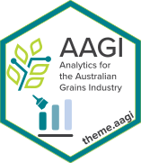
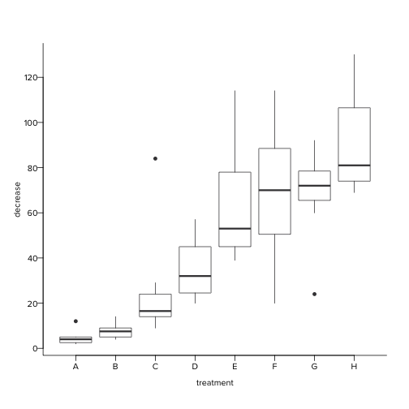
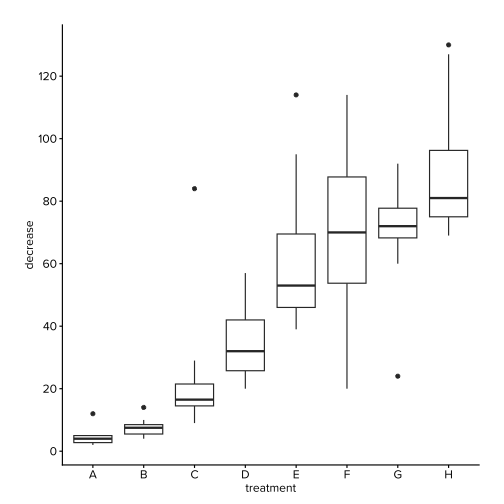
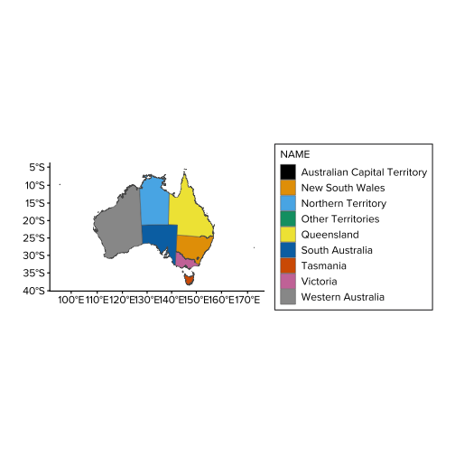

<!-- README.md is generated from README.Rmd. Please edit that file -->


<!-- badges: start -->
[](https://www.repostatus.org/#active)
[](https://github.com/AAGI-Org-AU-Public/AAGIThemes/actions/workflows/R-CMD-check.yaml)
<!-- badges: end -->

# {AAGIThemes} AAGI Branding for R Graphical and Tabular Outputs 

This repository contains the code for the R package {AAGIThemes}, which once installed in your R session (local or RStudio Server), provides helper functions for creating and exporting graphics created in R with a unified style that follows the AAGI brand guidelines.

The goal of {AAGIThemes} is to provide easy to use theming of R graphics for AAGI team members.
Following AAGI's brand guidelines, AAGI colours are used where applicable and the font defaults to Proxima Nova.
The resulting graphs, plots and charts feature a x and y axis that meet at 0 with no gridlines, but these can optionally be set to appear.

## Installation instructions

{AAGIThemes} is available through the [R-Universe](https://r-universe.dev/search) with pre-built binaries (this is the easy way).

To get started:

### Enable this universe


``` r
options(
  repos = c(
    AAGI = 'https://aagi-aus.r-universe.dev',
    CRAN = 'https://cloud.r-project.org'
  )
)
```

### Install


``` r
install.packages("AAGIThemes")
```

## Quick start

Following are some quick examples of {AAGIThemes} functionality.
However, you may wish to browse the vignette for a more detailed look at what the package offers using:


``` r
library("AAGIThemes")
vignette("AAGIThemes", package = "AAGIThemes")
```

### Create tabular outputs

{AAGIThemes} provides [{flextable}](https://davidgohel.github.io/flextable/) and [{gt}](https://gt.rstudio.com) themes suited for the AAGI style that works in HTML and Word document outputs.

#### Creating Themed {flextable} Outputs

You can use it like so with {flextable}.


``` r
library(dplyr)
library(flextable)

head(airquality) |>
  mutate(`Month Name` = "May") |>
  flextable() |>
  theme_ft_aagi()
```

<div class="tabwid"><style>.cl-901a27cc{}.cl-9016ebc0{font-family:'Proxima Nova';font-size:11pt;font-weight:bold;font-style:normal;text-decoration:none;color:rgba(255, 255, 255, 1.00);background-color:transparent;}.cl-9016ebca{font-family:'Proxima Nova';font-size:11pt;font-weight:normal;font-style:normal;text-decoration:none;color:rgba(65, 64, 66, 1.00);background-color:transparent;}.cl-90182436{margin:0;text-align:right;border-bottom: 0 solid rgba(0, 0, 0, 1.00);border-top: 0 solid rgba(0, 0, 0, 1.00);border-left: 0 solid rgba(0, 0, 0, 1.00);border-right: 0 solid rgba(0, 0, 0, 1.00);padding-bottom:5pt;padding-top:5pt;padding-left:5pt;padding-right:5pt;line-height: 1;background-color:transparent;}.cl-90182437{margin:0;text-align:left;border-bottom: 0 solid rgba(0, 0, 0, 1.00);border-top: 0 solid rgba(0, 0, 0, 1.00);border-left: 0 solid rgba(0, 0, 0, 1.00);border-right: 0 solid rgba(0, 0, 0, 1.00);padding-bottom:5pt;padding-top:5pt;padding-left:5pt;padding-right:5pt;line-height: 1;background-color:transparent;}.cl-9018323c{width:0.75in;background-color:rgba(0, 128, 139, 1.00);vertical-align: middle;border-bottom: 0.75pt solid rgba(255, 255, 255, 1.00);border-top: 0.75pt solid rgba(255, 255, 255, 1.00);border-left: 0.75pt solid rgba(255, 255, 255, 1.00);border-right: 0.75pt solid rgba(255, 255, 255, 1.00);margin-bottom:0;margin-top:0;margin-left:0;margin-right:0;}.cl-9018323d{width:0.75in;background-color:rgba(0, 128, 139, 1.00);vertical-align: middle;border-bottom: 0.75pt solid rgba(255, 255, 255, 1.00);border-top: 0.75pt solid rgba(255, 255, 255, 1.00);border-left: 0.75pt solid rgba(255, 255, 255, 1.00);border-right: 0.75pt solid rgba(255, 255, 255, 1.00);margin-bottom:0;margin-top:0;margin-left:0;margin-right:0;}.cl-9018323e{width:0.75in;background-color:rgba(242, 242, 242, 1.00);vertical-align: middle;border-bottom: 0.75pt solid rgba(255, 255, 255, 1.00);border-top: 0.75pt solid rgba(255, 255, 255, 1.00);border-left: 0.75pt solid rgba(255, 255, 255, 1.00);border-right: 0.75pt solid rgba(255, 255, 255, 1.00);margin-bottom:0;margin-top:0;margin-left:0;margin-right:0;}.cl-90183246{width:0.75in;background-color:rgba(242, 242, 242, 1.00);vertical-align: middle;border-bottom: 0.75pt solid rgba(255, 255, 255, 1.00);border-top: 0.75pt solid rgba(255, 255, 255, 1.00);border-left: 0.75pt solid rgba(255, 255, 255, 1.00);border-right: 0.75pt solid rgba(255, 255, 255, 1.00);margin-bottom:0;margin-top:0;margin-left:0;margin-right:0;}.tabwid {
  font-size: initial;
  padding-bottom: 1em;
}

.tabwid table{
  border-spacing:0px !important;
  border-collapse:collapse;
  line-height:1;
  margin-left:auto;
  margin-right:auto;
  border-width: 0;
  border-color: transparent;
  caption-side: top;
}
.tabwid-caption-bottom table{
  caption-side: bottom;
}
.tabwid_left table{
  margin-left:0;
}
.tabwid_right table{
  margin-right:0;
}
.tabwid td, .tabwid th {
    padding: 0;
}
.tabwid a {
  text-decoration: none;
}
.tabwid thead {
    background-color: transparent;
}
.tabwid tfoot {
    background-color: transparent;
}
.tabwid table tr {
background-color: transparent;
}
.katex-display {
    margin: 0 0 !important;
}</style><table data-quarto-disable-processing='true' class='cl-901a27cc'><thead><tr style="overflow-wrap:break-word;"><th class="cl-9018323c"><p class="cl-90182436"><span class="cl-9016ebc0">Ozone</span></p></th><th class="cl-9018323c"><p class="cl-90182436"><span class="cl-9016ebc0">Solar.R</span></p></th><th class="cl-9018323c"><p class="cl-90182436"><span class="cl-9016ebc0">Wind</span></p></th><th class="cl-9018323c"><p class="cl-90182436"><span class="cl-9016ebc0">Temp</span></p></th><th class="cl-9018323c"><p class="cl-90182436"><span class="cl-9016ebc0">Month</span></p></th><th class="cl-9018323c"><p class="cl-90182436"><span class="cl-9016ebc0">Day</span></p></th><th class="cl-9018323d"><p class="cl-90182437"><span class="cl-9016ebc0">Month Name</span></p></th></tr></thead><tbody><tr style="overflow-wrap:break-word;"><td class="cl-9018323e"><p class="cl-90182436"><span class="cl-9016ebca">41</span></p></td><td class="cl-9018323e"><p class="cl-90182436"><span class="cl-9016ebca">190</span></p></td><td class="cl-9018323e"><p class="cl-90182436"><span class="cl-9016ebca">7.4</span></p></td><td class="cl-9018323e"><p class="cl-90182436"><span class="cl-9016ebca">67</span></p></td><td class="cl-9018323e"><p class="cl-90182436"><span class="cl-9016ebca">5</span></p></td><td class="cl-9018323e"><p class="cl-90182436"><span class="cl-9016ebca">1</span></p></td><td class="cl-90183246"><p class="cl-90182437"><span class="cl-9016ebca">May</span></p></td></tr><tr style="overflow-wrap:break-word;"><td class="cl-9018323e"><p class="cl-90182436"><span class="cl-9016ebca">36</span></p></td><td class="cl-9018323e"><p class="cl-90182436"><span class="cl-9016ebca">118</span></p></td><td class="cl-9018323e"><p class="cl-90182436"><span class="cl-9016ebca">8.0</span></p></td><td class="cl-9018323e"><p class="cl-90182436"><span class="cl-9016ebca">72</span></p></td><td class="cl-9018323e"><p class="cl-90182436"><span class="cl-9016ebca">5</span></p></td><td class="cl-9018323e"><p class="cl-90182436"><span class="cl-9016ebca">2</span></p></td><td class="cl-90183246"><p class="cl-90182437"><span class="cl-9016ebca">May</span></p></td></tr><tr style="overflow-wrap:break-word;"><td class="cl-9018323e"><p class="cl-90182436"><span class="cl-9016ebca">12</span></p></td><td class="cl-9018323e"><p class="cl-90182436"><span class="cl-9016ebca">149</span></p></td><td class="cl-9018323e"><p class="cl-90182436"><span class="cl-9016ebca">12.6</span></p></td><td class="cl-9018323e"><p class="cl-90182436"><span class="cl-9016ebca">74</span></p></td><td class="cl-9018323e"><p class="cl-90182436"><span class="cl-9016ebca">5</span></p></td><td class="cl-9018323e"><p class="cl-90182436"><span class="cl-9016ebca">3</span></p></td><td class="cl-90183246"><p class="cl-90182437"><span class="cl-9016ebca">May</span></p></td></tr><tr style="overflow-wrap:break-word;"><td class="cl-9018323e"><p class="cl-90182436"><span class="cl-9016ebca">18</span></p></td><td class="cl-9018323e"><p class="cl-90182436"><span class="cl-9016ebca">313</span></p></td><td class="cl-9018323e"><p class="cl-90182436"><span class="cl-9016ebca">11.5</span></p></td><td class="cl-9018323e"><p class="cl-90182436"><span class="cl-9016ebca">62</span></p></td><td class="cl-9018323e"><p class="cl-90182436"><span class="cl-9016ebca">5</span></p></td><td class="cl-9018323e"><p class="cl-90182436"><span class="cl-9016ebca">4</span></p></td><td class="cl-90183246"><p class="cl-90182437"><span class="cl-9016ebca">May</span></p></td></tr><tr style="overflow-wrap:break-word;"><td class="cl-9018323e"><p class="cl-90182436"><span class="cl-9016ebca"></span></p></td><td class="cl-9018323e"><p class="cl-90182436"><span class="cl-9016ebca"></span></p></td><td class="cl-9018323e"><p class="cl-90182436"><span class="cl-9016ebca">14.3</span></p></td><td class="cl-9018323e"><p class="cl-90182436"><span class="cl-9016ebca">56</span></p></td><td class="cl-9018323e"><p class="cl-90182436"><span class="cl-9016ebca">5</span></p></td><td class="cl-9018323e"><p class="cl-90182436"><span class="cl-9016ebca">5</span></p></td><td class="cl-90183246"><p class="cl-90182437"><span class="cl-9016ebca">May</span></p></td></tr><tr style="overflow-wrap:break-word;"><td class="cl-9018323e"><p class="cl-90182436"><span class="cl-9016ebca">28</span></p></td><td class="cl-9018323e"><p class="cl-90182436"><span class="cl-9016ebca"></span></p></td><td class="cl-9018323e"><p class="cl-90182436"><span class="cl-9016ebca">14.9</span></p></td><td class="cl-9018323e"><p class="cl-90182436"><span class="cl-9016ebca">66</span></p></td><td class="cl-9018323e"><p class="cl-90182436"><span class="cl-9016ebca">5</span></p></td><td class="cl-9018323e"><p class="cl-90182436"><span class="cl-9016ebca">6</span></p></td><td class="cl-90183246"><p class="cl-90182437"><span class="cl-9016ebca">May</span></p></td></tr></tbody></table></div>

### Plots and graphs

{AAGIThemes} provides several functions to assist users in creating plots, charts and graphs with a more unified AAGI style.

For creating standalone graphs using R's base library there are:

  * `barplot_aagi()`,

  * `boxplot_aagi()`,

  * `hist_aagi()`, and

  * `plot_aagi()`.

#### Using the basic plot functions

Example of how the base graphics functionality with AAGI style pre-applied is used:


``` r
boxplot_aagi(
  decrease ~ treatment,
  data = OrchardSprays,
  xlab = "treatment",
  ylab = "decrease"
)
```

<div class="figure">

<p class="caption">An example plot illustrating the use of AAGIThemes with R's base plot capabilities.</p>
</div>

#### Using ggplot2 theming

The function `theme_aagi()` is provided to apply a unified style for creating AAGI themed plots, charts and graphs using {ggplot2}.
The function is very basic and provides only one parameter, `base_size`, which is used to set the font size (in points) used in the resulting figure.
No adjustments are made by the type of graph being produced, so you may wish to add grid lines or change the colour palette that is used to alter point or line colours in your graph.

Example of how `theme_aagi()` is used in a standard {ggplot2} workflow:


``` r
library(ggplot2)

ggplot(data = OrchardSprays, aes(x = treatment, y = decrease)) +
  geom_boxplot() +
  scale_y_continuous(breaks = seq(0, 120, by = 20)) +
  theme_aagi()
```

<div class="figure">

<p class="caption">An example plot illustrating the use of AAGIThemes with ggplot2.</p>
</div>

### Maps

Example of a map made with {ggplot2} and {AAGIThemes}.


``` r
library(AAGIThemes)
library(AAGIPalettes)
library(ggplot2)
library(ozmaps)

sf_oz <- ozmap_data("states")

ggplot(sf_oz, aes(fill = NAME)) +
  geom_sf() +
  coord_sf(
    crs = "+proj=lcc +lon_0=135 +lat_0=-30 +lat_1=-10 +lat_2=-45 +datum=WGS84"
  ) +
  scale_fill_manual(values = unname(palette.colors(palette = "Okabe-Ito"))) +
  theme_aagi()
```

<div class="figure">

<p class="caption">An example map illustrating the use of AAGIThemes with ggplot2.</p>
</div>

## Logo Rights

The logo of this project and the AAGI strategic partners do not come under MIT License.
The Analytics for the Australian Grains Industry (AAGI) project retains full rights to the AGGI logo and the Grains Research and Development Corporation (GRDC) and strategic partners, Curtin University, the University of Queensland and Adelaide University, retain full rights to their own logos, respectively.
