# AAGIThemes

## How to Create AAGI Style Graphics and Tables

The CCDM CBADA team has developed an R package, {AAGIThemes}, and this R
cookbook to help ease the process of creating publication-ready graphics
in our in-house style using R’s {graphics}, {ggplot2} and {flextable}
libraries a more reproducible process, as well as making it easier for
people new to R to create beautiful graphics and tables that adhere to
AAGI style guidelines.

## Getting started

### Install the {AAGIThemes} package

{AAGIThemes} is not on CRAN, so you will have to install it directly
from our GitHub repository using {remotes}.

If you do not have the {remotes} package installed, you will have to run
the first line in the code below as well.

``` r
if (!require("remotes")) {
  remotes::install_github("AAGI-AUS/AAGIThemes",
    build_vignettes = TRUE
  )
}
```

For more info on {AAGIThemes} check out the [package’s GitHub
repository](https://github.com/AAGI-AUS/AAGIThemes), but most of the
details about how to use the package and its functions are detailed
below.

When you have downloaded the package and successfully installed it you
are good to go and create plots and tables.

## Creating Tables

Creating AAGI themed tables requires using {flextable}. Using the
`airquality` data set, and adding a text column to illustrate how text
columns are handled, here’s how to apply an AAGI theme to a table.

``` r
library("AAGIThemes")
library("flextable")
library("dplyr")
#> 
#> Attaching package: 'dplyr'
#> The following objects are masked from 'package:stats':
#> 
#>     filter, lag
#> The following objects are masked from 'package:base':
#> 
#>     intersect, setdiff, setequal, union

ft <- flextable(head(airquality) |>
  mutate(`Month Name` = "May"))
ft <- theme_ft_aagi(ft)
ft
```

| Ozone | Solar.R | Wind | Temp | Month | Day | Month Name |
|-------|---------|------|------|-------|-----|------------|
| 41    | 190     | 7.4  | 67   | 5     | 1   | May        |
| 36    | 118     | 8.0  | 72   | 5     | 2   | May        |
| 12    | 149     | 12.6 | 74   | 5     | 3   | May        |
| 18    | 313     | 11.5 | 62   | 5     | 4   | May        |
|       |         | 14.3 | 56   | 5     | 5   | May        |
| 28    |         | 14.9 | 66   | 5     | 6   | May        |

### On {ggplot2} Plots and Graphs

Most of the focus of {AAGIThemes} is given to supporting
{[ggplot2](https://ggplot2.tidyverse.org/R)} visualisations, but {base}
and {graphics} plotting functionality are also supported. The focus is
given to {ggplot2} as it is more verbose and efficient in creating data
visualization based on “*The Grammar of Graphics*” (Wilkinson 2012). The
layered grammar makes developing charts more structural and easy to
interpret (after you know how to use {ggplot2} of course). One of the
greatest strengths of {ggplot2} is the ability to customise it so
easily. Several themes and colour palettes already exist for {ggplot2}
to Create the visualisation look professional and engaging for the end
users. {AAGIThemes} leverages the ability to customise the appearance
{ggplot2} to create a theme that is clean, easy to use and follows
AAGI’s style guidelines including fonts and colours.

When using {AAGIThemes} for graphs, the legend will be placed at the top
by default and the main and sub-titles will be left aligned and captions
will be right aligned. These choices can all be overridden by using
[`ggplot2::theme()`](https://ggplot2.tidyverse.org/reference/theme.html)
arguments as you wish.

### Load the Libraries We’ll Need

A few of the steps in this cookbook - and to create charts in R in
general - require certain packages to be installed and loaded. So that
you do not have to load them one by one, you can use the the following
code to load them all at once.

``` r
x <-
  c(
    "dplyr",
    "gapminder",
    "ggplot2",
    "AAGIPalettes",
    "AAGIThemes",
    "tibble"
  )
invisible(lapply(
  X = x,
  FUN = library,
  character.only = TRUE
))
```

## Using {AAGIThemes} to Create Graphical Outputs

{AAGIThemes} provides several functions to assist users in creating
plots, charts and graphs with a more unified AAGI style. Following are
examples of four major styles of graphs that are commonly used, bar
plots, boxplots, histograms and lines and scatter plots.

### Bar Plots

#### Using Base R to Create a bar plot

``` r
barplot_aagi(islands)
```


#### Using {ggplot2} to Create a Bar Plot

We need to transform a named vector to a `data.frame` for {ggplot2} to
be able to use it, so we’ll create a {tibble} first, `islands_df` and
then plot it.

``` r
islands_df <- tibble(name = names(islands), value = islands)

ggplot(data = islands_df, aes(x = name, y = value)) +
  geom_col() +
  theme_aagi() +
  theme(axis.text.x = element_text(angle = 90, hjust = 1))
```


Although those names are a bit difficult to read on the x-axis, so we
can flip the coordinates so that they are easier to read.

``` r
ggplot(data = islands_df, aes(x = name, y = value)) +
  geom_col() +
  theme_aagi() +
  coord_flip()
```


### Boxplots

#### Using Base R to Create a Boxplot

``` r
boxplot_aagi(decrease ~ treatment,
  data = OrchardSprays,
  xlab = "treatment",
  ylab = "decrease"
)
```

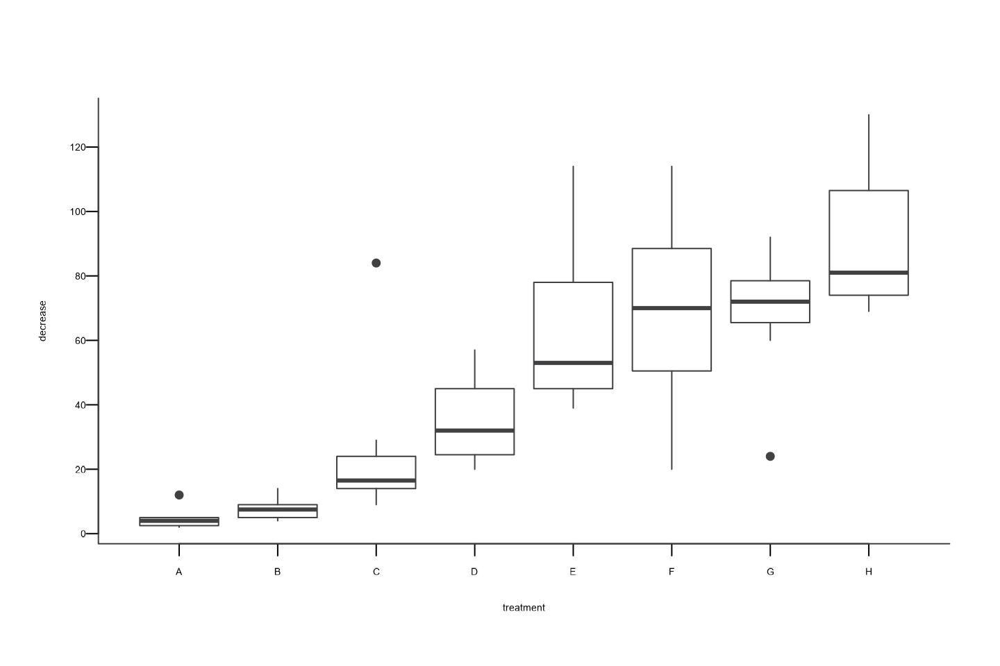

#### Using {ggplot2} to Create a Boxplot

``` r
library("AAGIThemes")
library("ggplot2")

ggplot(data = OrchardSprays, aes(x = treatment, y = decrease)) +
  geom_boxplot() +
  scale_y_continuous(breaks = seq(0, 120, by = 20)) +
  theme_aagi()
```

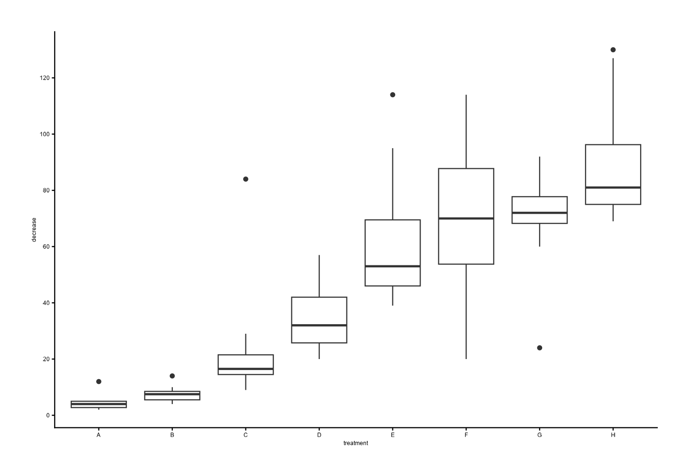

### Histograms

#### Using Base R to Create a Histogram

``` r
library("ggplot2") # for diamonds data set
hist_aagi(diamonds$carat)
#> Warning in plot.window(xlim, ylim, log, ...): "panel.first" is not a graphical
#> parameter
#> Warning in title(main = main, sub = sub, xlab = xlab, ylab = ylab, ...):
#> "panel.first" is not a graphical parameter
#> Warning in axis(1, ...): "panel.first" is not a graphical parameter
#> Warning in axis(2, at = yt, ...): "panel.first" is not a graphical parameter
```

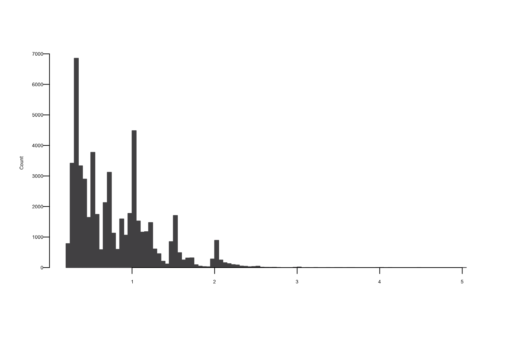

#### Using {ggplot2} to Create a Histogram

``` r
ggplot(data = diamonds, aes(x = carat)) +
  geom_histogram() +
  theme_aagi()
#> `stat_bin()` using `bins = 30`. Pick better value `binwidth`.
```

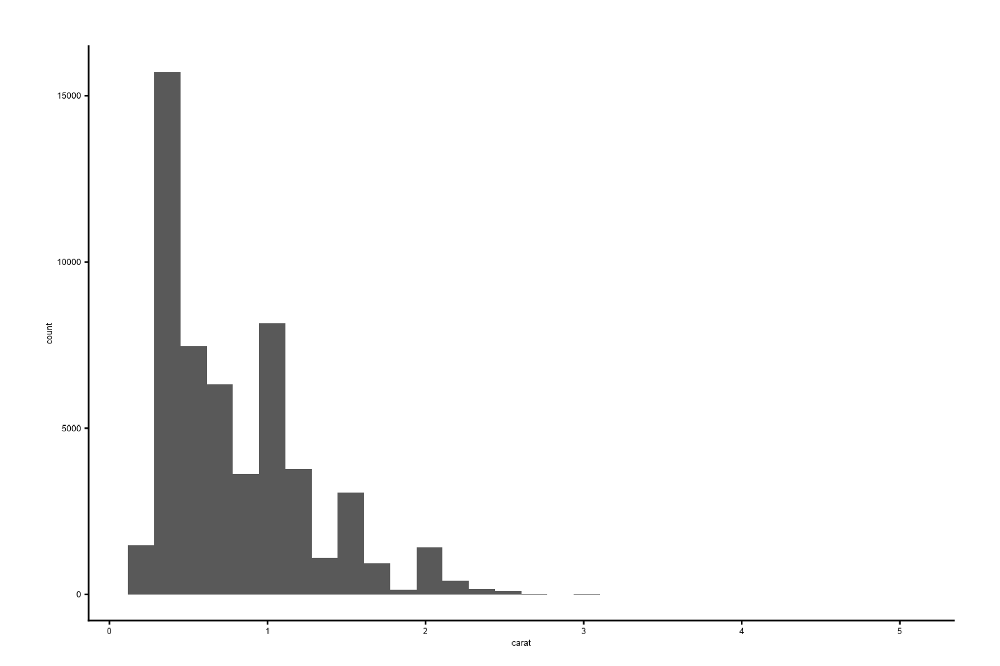

### Line Graphs

Using the {gapminder} data, we can make the following figure of life
expectancy over time in Malawi with the line in AAGI’s turquoise colour.

#### Using Base R to Create a Line Graph

``` r
# Data for chart from {gapminder} package
line_df <- gapminder |>
  filter(country == "Malawi") |>
  arrange(year)

plot_aagi(
  x = line_df$year,
  y = line_df$lifeExp,
  col = AAGIPalettes::colour_as_hex("AAGI Teal"),
  type = "l",
  main = "Living longer",
  xlab = "Year",
  ylab = "Life expectancy",
  sub = "Life expectancy in Malawi 1952-2007"
)
```

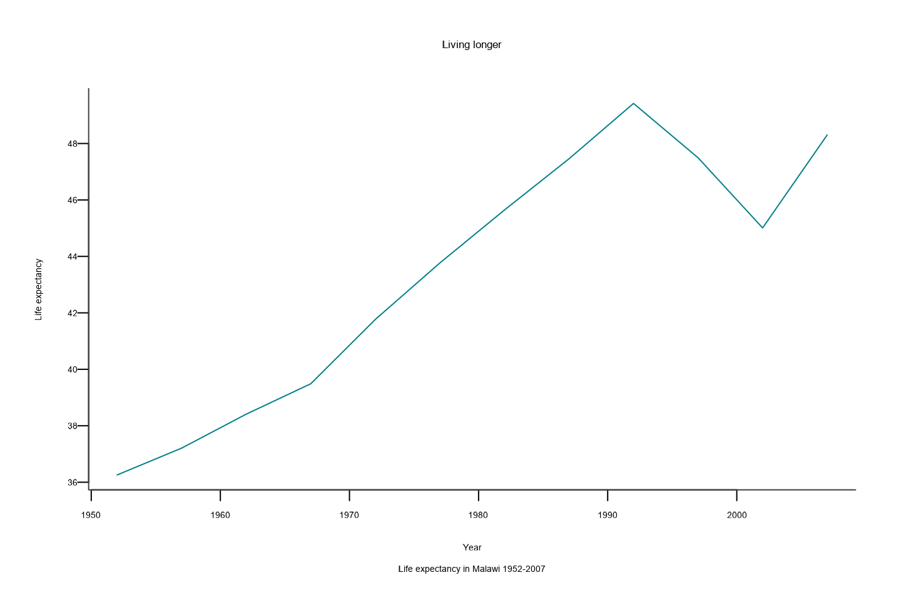

#### Using {ggplot2} to Create a Line Graph

``` r
ggplot(line_df, aes(x = year, y = lifeExp)) +
  geom_line(colour = AAGIPalettes::colour_as_hex("AAGI Teal")) +
  theme_aagi() +
  ylab("Life expectancy") +
  xlab("Year") +
  labs(
    title = "Living longer",
    subtitle = "Life expectancy in Malawi 1952-2007"
  )
```

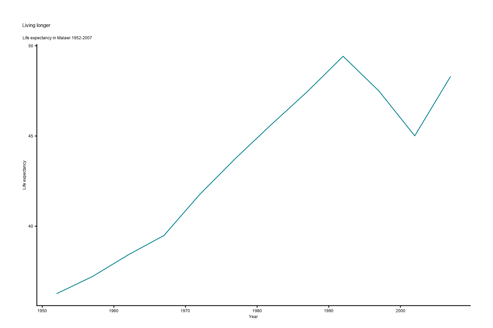

### Scatterplots

``` r
# Create data
data <- data.frame(
  x = seq(1:100) + 0.1 * seq(1:100) * sample(c(1:10), 100, replace = TRUE),
  y = seq(1:100) + 0.2 * seq(1:100) * sample(c(1:10), 100, replace = TRUE)
)
```

#### Using base R to Create a Scatterplot

``` r
# Basic scatterplot
plot_aagi(x = data$x, y = data$y)
```

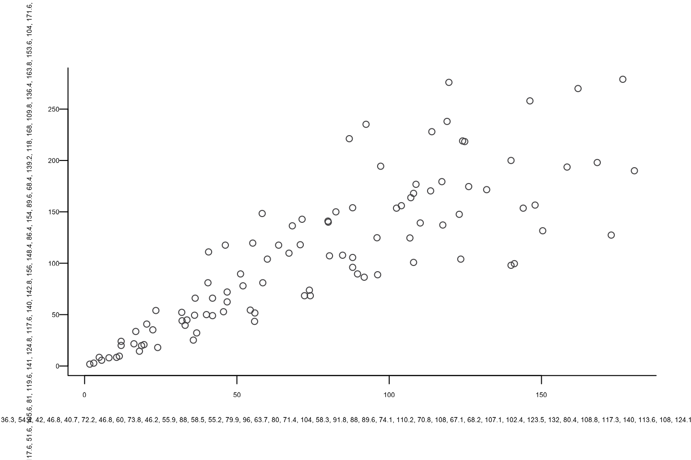

#### Using {ggplot2} to Create a Scatterplot

``` r
ggplot(data = data, aes(x = x, y = y)) +
  geom_point() +
  theme_aagi()
```

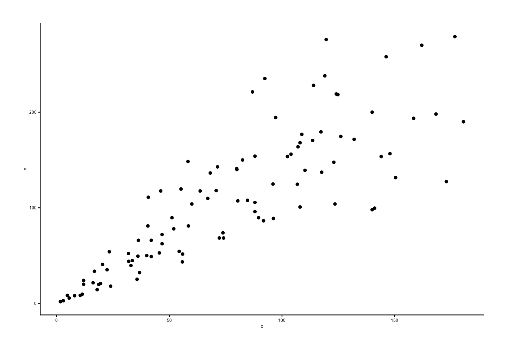

## Colours in {AAGIThemes}

### AAGI Colours

{AAGIThemes} imports official AAGI colours for use in plots and also
applies them to {ggplot2} facet strips and uses them in the MS Word and
PowerPoint templates for colour matching in the outputs from
{AAGIPalettes}.

``` r
library(AAGIPalettes)
display_aagi_cols("aagi_colours")
```

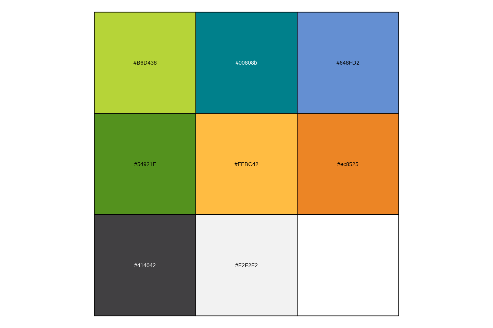

### Using AAGI Colours

We’ve already seen above in the [line graph](#Linegraphs) example how to
use the colours in a graph. But for further demonstration, here are a
few more examples.

Here we’ll again use the {gapminder} data to construct a stacked bar
chart and use AAGI’s colours in
[`scale_fill_manual()`](https://ggplot2.tidyverse.org/reference/scale_manual.html).

``` r
# prepare data
stacked_df <- gapminder |>
  filter(year == 2007) |>
  mutate(lifeExpGrouped = cut(
    lifeExp,
    breaks = c(0, 50, 65, 80, 90),
    labels = c("Under 50", "50-65", "65-80", "80+")
  )) |>
  group_by(continent, lifeExpGrouped) |>
  summarise(continentPop = sum(as.numeric(pop)))
#> `summarise()` has regrouped the output.
#> ℹ Summaries were computed grouped by continent and lifeExpGrouped.
#> ℹ Output is grouped by continent.
#> ℹ Use `summarise(.groups = "drop_last")` to silence this message.
#> ℹ Use `summarise(.by = c(continent, lifeExpGrouped))` for per-operation
#>   grouping (`?dplyr::dplyr_by`) instead.

# set order of stacks by changing factor levels
stacked_df$lifeExpGrouped <- factor(stacked_df$lifeExpGrouped,
  levels = rev(levels(stacked_df$lifeExpGrouped))
)

# create plot
ggplot(
  data = stacked_df,
  aes(
    x = continent,
    y = continentPop,
    fill = lifeExpGrouped
  )
) +
  geom_bar(
    stat = "identity",
    position = "fill"
  ) +
  scale_fill_manual(
    name = "Life expectancy",
    values = aagi_palettes(n = 4, name = "aagi_greens")
  ) +
  ylab("Continental Population (%)") +
  xlab("Continent") +
  theme_aagi() +
  scale_y_continuous(labels = scales::percent) +
  geom_hline(
    yintercept = 0,
    linewidth = 1,
    colour = "#474747"
  ) +
  labs(
    title = "How life expectancy varies",
    subtitle = "% of population by life expectancy band, 2007"
  ) +
  guides(fill = guide_legend(reverse = TRUE))
```

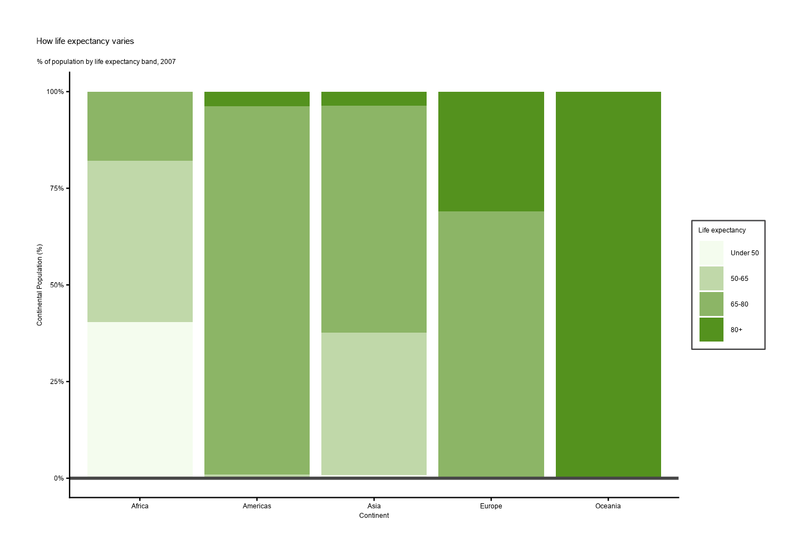

## Advanced Uses

### Using {ggplot2} Faceting

As we’ll be using this figure for the next example, we’ll generate an
object in R called `p` and save it to R’s
[`tempdir()`](https://rdrr.io/r/base/tempfile.html) for use in the next
example as well.

``` r
# Prepare data
facet <- gapminder |>
  filter(continent != "Americas") |>
  group_by(continent, year) |>
  summarise(pop = sum(as.numeric(pop)))
#> `summarise()` has regrouped the output.
#> ℹ Summaries were computed grouped by continent and year.
#> ℹ Output is grouped by continent.
#> ℹ Use `summarise(.groups = "drop_last")` to silence this message.
#> ℹ Use `summarise(.by = c(continent, year))` for per-operation grouping
#>   (`?dplyr::dplyr_by`) instead.

col_values <- c(
  AAGIPalettes::colour_as_hex("AAGI Teal"),
  AAGIPalettes::colour_as_hex("AAGI Green"),
  AAGIPalettes::colour_as_hex("AAGI Yellow"),
  AAGIPalettes::colour_as_hex("AAGI Blue")
)

# Make plot
p <- ggplot() +
  geom_area(data = facet, aes(x = year, y = pop, fill = continent)) +
  scale_fill_manual(values = col_values) +
  facet_wrap(~continent, ncol = 5) +
  scale_y_continuous(
    breaks = c(0, 2000000000, 4000000000),
    labels = c(0, "2bn", "4bn")
  ) +
  theme_aagi() +
  geom_hline(
    yintercept = 0,
    linewidth = 1,
    colour = "#474747"
  ) +
  theme(legend.position = "none", axis.text.x = element_blank()) +
  labs(title = "Asia's rapid growth", subtitle = "Population growth by continent, 1952-2007")

ggsave(p, filename = "AAGI.png", path = tempdir())
#> Saving 7.5 x 5 in image

print(p)
```

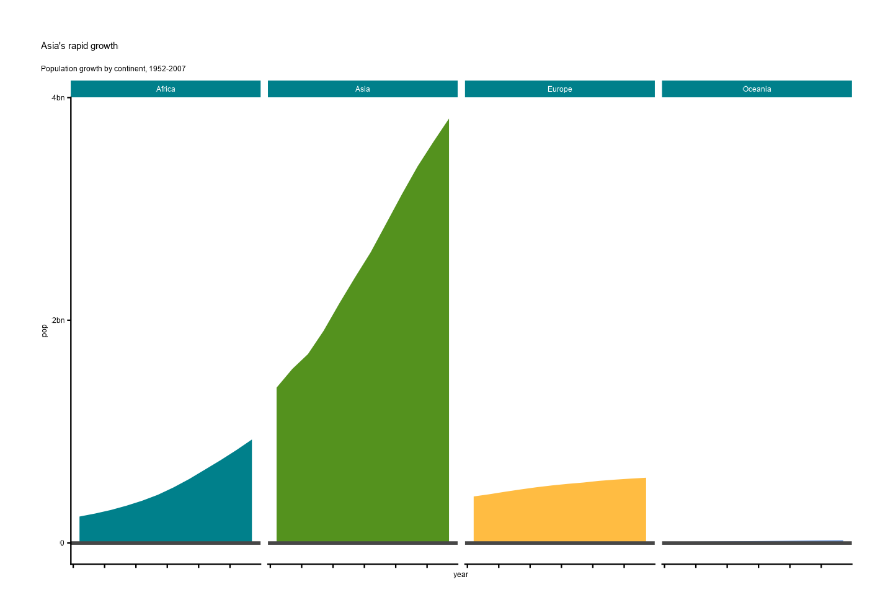

### Adding the AAGI Logo to Your Figures

Add the AAGI logo to the upper left of the previous plot as per the
style guide. Use the
[`add_aagi_logo()`](https://AAGI-AUS.github.io/AAGIThemes/reference/add_aagi_logo.md)
function to add the logo automatically to a previously saved image file.
In this case, the previous example used to show the faceting colours has
been saved to R’s [`tempdir()`](https://rdrr.io/r/base/tempfile.html).
You can save using [`tempdir()`](https://rdrr.io/r/base/tempfile.html)
as illustrated above or save on your Documents folder or elsewhere and
access it from there as well. The image is resized to be 600x1000 pixels
before being displayed here. Feel free to adjust as necessary.

``` r
library(magick)
add_aagi_logo(
  file_in = file.path(tempdir(), "AAGI.png"),
  file_out = file.path(tempdir(), "AAGI_logo.png")
)

image_read(file.path(tempdir(), "AAGI_logo.png")) |>
  image_resize("600x1000") |>
  print()
#> # A tibble: 1 × 7
#>   format width height colorspace matte filesize density
#>   <chr>  <int>  <int> <chr>      <lgl>    <int> <chr>  
#> 1 PNG      600    480 sRGB       FALSE        0 118x118
```

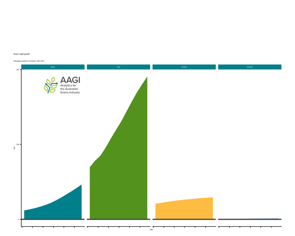

## Saving {ggplot2} Figures

When saving figures generated with {ggplot2} that use {AAGIThemes} as
the theme, PDFs will not properly embed the Proxima Nova font that is
used. In order for you to save your figures and preserve the font, you
can either save as a .png file or use the `device` option in
[`ggsave()`](https://ggplot2.tidyverse.org/reference/ggsave.html), which
is demonstrated as follows.

``` r
ggsave(
  filename = "cairo_font.pdf",
  plot = p,
  device = cairo_pdf,
  path = tempdir()
)
#> Saving 7.5 x 5 in image
```

### Cairo Instructions for macOS

You should already have the Cairo graphics library installed when you
install R, unless you use the Homebrew version, *e.g.*,
`brew install r`. You can verify that you have Cairo support by running
the [`capabilities()`](https://rdrr.io/r/base/capabilities.html)
function; `TRUE` should show up under cairo:

``` r
capabilities()
#>        jpeg         png        tiff       tcltk         X11        aqua 
#>        TRUE        TRUE        TRUE        TRUE       FALSE       FALSE 
#>    http/ftp     sockets      libxml        fifo      cledit       iconv 
#>        TRUE        TRUE       FALSE        TRUE       FALSE        TRUE 
#>         NLS       Rprof     profmem       cairo         ICU long.double 
#>        TRUE        TRUE        TRUE        TRUE        TRUE        TRUE 
#>     libcurl 
#>        TRUE
```

If you do not see `TRUE` under “cairo”, check that you’ve installed a
version of R using the Homebrew cask, different than `brew install r`,
this installs the vanilla version of R as built by the R team or using
rig, <https://github.com/r-lib/rig>, to manage your R installation if
you’re not just installing the default R binary.

So, you should not need to install any R-specific Cairo libraries or
anything for this to work. However, you will need an X11 window system
first, like XQuartz. You can install XQuartz like so.

``` bash
$ brew install xquartz
```

### Cairo Instructions for Windows

You will already have the Cairo graphics library installed when you
install R. There is no need to do anything else to Create it work on
this platform.

Wilkinson, Leland. 2012. *The Grammar of Graphics*. Springer.
